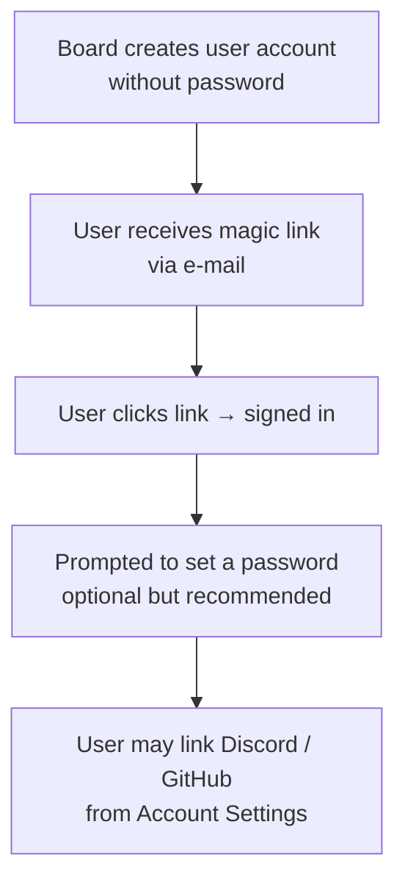
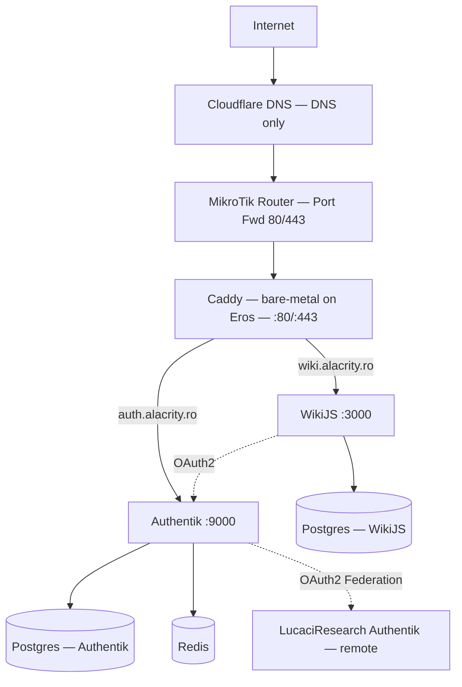

# Alacrity Education — Mixed Wiki Platform Architecture

## Summary

This document describes the architecture for **Alacrity Education's public/private wiki platform**, hosted at [wiki.alacrity.ro](https://wiki.alacrity.ro). The platform is a [WikiJS](https://js.wiki) instance backed by a centralised identity provider ([Authentik](https://goauthentik.io)), reverse-proxied through [Caddy](https://caddyserver.com), and running on a single on-premise server at the Alacrity lab.

### User Experience at a Glance

From a visitor's perspective the wiki behaves as a **mixed public/private knowledge base**:

- **Unauthenticated visitors** (Guests) can browse every page the editors have chosen to make public — project write-ups, guides, event recaps, and general information about Alacrity Education.
- **Authenticated users** log in via a single *"Sign in with Alacrity"* button, which redirects to `auth.alacrity.ro`. From there they can authenticate with a password, a magic e-mail link, or — if they have linked their accounts — with Discord or GitHub. Members of the Clockworks organisation can sign in directly through their existing LucaciResearch Authentik account.
- Once signed in, users land in the **Editor** role inside WikiJS, gaining access to private pages (internal procedures, meeting notes, drafts) and the ability to create and edit content according to their permissions.

The identity layer is designed to scale: the same Authentik instance can serve as the SSO provider for any future Alacrity service, not just the wiki.

---

## Physical Infrastructure

### Hardware

| Component | Specification |
|---|---|
| **Machine** | Dell OptiPlex 3060 |
| **CPU** | Intel Core i3 (8th gen) |
| **RAM** | 16 GB |
| **Storage** | 500 GB PCIe SSD |
| **Hostname** | `eros` |
| **Internal DNS** | `eros.lr` |

The server is rack-mounted in the Alacrity lab alongside the existing networking equipment.

### Network

| Parameter | Value |
|---|---|
| **VLAN** | 30 |
| **Subnet** | `10.12.3.0/24` |
| **Server address** | `10.12.3.3` |

A port-forwarding rule on the MikroTik edge router exposes TCP ports **80** and **443** from `10.12.3.3` to the public internet, allowing Caddy to terminate TLS and serve both `wiki.alacrity.ro` and `auth.alacrity.ro`.

### Operating System

Eros runs **Arch Linux** and acts primarily as a Docker host. All application services are deployed as Docker Compose stacks, with the sole exception of Caddy, which runs bare-metal (see [Caddy Reverse Proxy](#caddy-reverse-proxy)).

---

## DNS

### Record Layout

Digi provides the dynamic/static hostname **`alacrityhub.go.ro`**, which resolves to the lab's public IP. Both service domains are `CNAME` records pointing at this hostname with a **TTL of 300 seconds (5 minutes)**:

| Record | Type | Target | TTL |
|---|---|---|---|
| `wiki.alacrity.ro` | CNAME | `alacrityhub.go.ro` | 300 |
| `auth.alacrity.ro` | CNAME | `alacrityhub.go.ro` | 300 |

A 5-minute TTL is low enough to allow reasonably fast failover or IP changes (common with consumer-grade uplinks) while still being high enough to avoid excessive DNS query volume. If the upstream IP is fully static, the TTL can be raised to 3600 (1 h) later.

### Disabling Cloudflare CNAME Flattening

By default, Cloudflare flattens `CNAME` records at the zone apex and may also flatten non-apex records when the orange-cloud proxy is enabled. Since `wiki` and `auth` are subdomains (not the apex), the main action required is:

1. Log in to the [Cloudflare Dashboard](https://dash.cloudflare.com) and select the `alacrity.ro` zone.
2. Navigate to **DNS → Records**.
3. For each `CNAME` record (`wiki`, `auth`), ensure the **Proxy status** toggle is set to **DNS only** (grey cloud), not **Proxied** (orange cloud). When the record is DNS-only, Cloudflare returns the raw `CNAME` without flattening or proxying.
4. If the zone is on a plan that exposes the *CNAME Flattening* setting (Business or Enterprise), go to **DNS → Settings** and set CNAME flattening to **Flatten at the zone apex only** (the default). This has no effect on subdomain records but is good hygiene.

> **Why disable the proxy?** Caddy handles TLS termination and certificate management via ACME (Let's Encrypt). If Cloudflare's proxy is active, it will present its own certificate and interfere with Caddy's ACME HTTP-01 challenges, potentially causing certificate issuance failures or double-encryption overhead.

---

## Application Services

Each service is deployed as a standalone `docker-compose.yaml` stack on Eros.

### Authentik — Identity Provider

| | |
|---|---|
| **URL** | `https://auth.alacrity.ro` |
| **Containers** | `authentik-server`, `authentik-worker`, `authentik-postgres`, `authentik-redis` |
| **Purpose** | Centralised authentication and authorisation for all Alacrity services |

#### Authentication Sources

Account **self-registration is disabled**. All accounts are provisioned by the Alacrity Board. The following authentication methods are supported:

| # | Method | Self-Registration | Notes |
|---|---|---|---|
| **A** | Password (local) | ✗ | Board pre-creates the account *without* a password. The user receives a magic e-mail link to sign in for the first time and is then prompted to set a password. |
| **B** | Discord (social login) | ✗ | Cannot be used to create new accounts. Users link their Discord account from the Authentik *Account Settings* page after initial sign-in, and can then use *Login with Discord* on subsequent visits. |
| **C** | GitHub (social login) | ✗ | Same linking flow as Discord. Particularly convenient for developers. |
| **D** | LucaciResearch Authentik (OAuth2 federation) | ✓ | An existing remote Authentik instance that serves as the directory for **Clockworks** members. Self-registration *is* enabled for this source so that the Alacrity Board does not need to manually synchronise Clockworks account operations. Users arriving through this provider are automatically placed in the **Clockworks Members** group. |

> Methods **B** and **C** are especially useful for **mobile sign-in**, where typing long passwords is inconvenient.

#### Account Creation Flow



#### Groups

Authentik groups partition users for role-based access control:

| Group | Population | Purpose |
|---|---|---|
| **Volunteer** | Alacrity volunteers (post contract signing) | Base access tier for all active volunteers |
| **Board** | Alacrity Board members | Administrative access |
| **Clockworks Members** | Auto-populated via LucaciResearch federation | Access rights specific to Clockworks collaborators |
| **Service** | API accounts (tokens & app passwords) | Machine-to-machine access to protected applications |

#### Roles & RBAC

Authentik provides a full **Role-Based Access Control** system. Roles are the component that actually grants access: a role encapsulates a set of permissions for a given application, and is then *assigned to one or more groups*. Users never receive permissions directly — they inherit them through their group memberships.

Concrete role definitions for each application are **to be determined** during the deployment phase, once the full set of applications and their permission models are known.

---

### WikiJS — Knowledge Base

| | |
|---|---|
| **URL** | `https://wiki.alacrity.ro` |
| **Containers** | `wikijs`, `wikijs-postgres` |
| **Purpose** | Public/private wiki for Alacrity Education |

#### Authentication

- **Local authentication and password login are disabled.** The only sign-in method is OAuth2, redirecting to `auth.alacrity.ro`.
- Every user who successfully authenticates through Alacrity Authentik is automatically added to the WikiJS **Editor** group (this is a WikiJS-internal group, not an Authentik group).

#### Page Visibility Model

WikiJS supports granular per-page and per-folder permissions. The two primary audiences are:

| Audience | WikiJS Group | Capabilities |
|---|---|---|
| **Public visitors** | `Guest` (unauthenticated) | Read public pages only |
| **Signed-in users** | `Editor` | Read all pages; create and edit pages (per their assigned permissions) |

Content authors control visibility at page creation time: a page can be marked as visible to Guests (public) or restricted to Editors only (private). This is the mechanism that makes the wiki a *mixed* public/private knowledge base.

#### Analytics

Page interactions can optionally be tracked using an external analytics provider such as [Statcounter](https://statcounter.com), [Plausible](https://plausible.io), or [Umami](https://umami.is). WikiJS supports injecting custom HTML/JS into page headers or footers, which is sufficient for any tag-based analytics solution.

#### Search & Comments

The deployment will use WikiJS's **built-in database search engine** and **default comment system**. No external search or comment backends are required at this stage.

#### Future: Authentik-to-WikiJS Group Mapping

In the initial deployment, all authenticated users share a single WikiJS group (Editor). In the future, we will research whether it is possible to map **Authentik roles** (passed as claims in the OAuth2 token) to **WikiJS groups**, enabling more fine-grained permissions — for example, restricting certain page trees to Board members only, without requiring manual group management inside WikiJS.

---

## Caddy Reverse Proxy

Caddy runs **bare-metal** on Eros (not inside Docker). It listens on ports **80** and **443**, automatically obtains and renews TLS certificates from Let's Encrypt via the ACME HTTP-01 challenge, and reverse-proxies requests to the appropriate Docker service based on the `Host` header.

Two directives in the Caddyfile map each public domain to its backend: `auth.alacrity.ro` → Authentik on port 9000, and `wiki.alacrity.ro` → WikiJS on port 3000. Caddy infers HTTPS, provisions certificates, and handles HTTP→HTTPS redirection automatically.

---

## Architecture Diagram

```kroki {type=blockdiag}
blockdiag {
  orientation = portrait;

  Internet [label = "Internet"];
  Cloudflare [label = "Cloudflare DNS\n(DNS-only, no proxy)"];
  MikroTik [label = "MikroTik Router\nPort Fwd 80/443"];
  Caddy [label = "Caddy\n(bare-metal)\n:80 / :443"];
  Authentik [label = "Authentik\n:9000"];
  WikiJS [label = "WikiJS\n:3000"];
  AuthPG [label = "Postgres\n(Authentik)"];
  WikiPG [label = "Postgres\n(WikiJS)"];
  Redis [label = "Redis\n(Authentik)"];
  LR [label = "LucaciResearch\nAuthentik\n(remote)"];

  Internet -> Cloudflare -> MikroTik -> Caddy;
  Caddy -> Authentik;
  Caddy -> WikiJS;
  Authentik -> AuthPG;
  Authentik -> Redis;
  WikiJS -> WikiPG;
  WikiJS -> Authentik [label = "OAuth2"];
  Authentik -> LR [label = "OAuth2\nFederation"];
}
```

> *If your WikiJS instance does not have the Kroki renderer enabled, the diagram above can be replaced with a Mermaid block or a static image.*

**Simplified Mermaid alternative:**



---

## Scalability to More Services

The Authentik instance deployed on Eros is not limited to the wiki — it is designed to serve as the **single sign-on (SSO) provider for all Alacrity Education services**, current and future.

### Supported Protocols

Authentik supports several authentication and authorisation protocols out of the box:

- **OAuth2 / OpenID Connect** — used by WikiJS and most modern web applications.
- **LDAP** — Authentik can expose an LDAP interface, useful for services that only support directory-based authentication (e.g., Gitea, Portainer, some network appliances).
- **Forward Auth / Proxy Authentication** — Authentik can act as an authentication middleware in front of any HTTP service (see below).

### Protected Reverse Proxy

For applications that have no built-in SSO support, Authentik's **Proxy Provider** can be placed in front of the service. In this mode, Caddy forwards the authentication decision to Authentik, and only passes the request through to the upstream service if the user has a valid session. This means virtually *any* web application can be protected with Alacrity SSO, even if it has no authentication system of its own.

### Hosting Additional Services

Eros has sufficient headroom (i3-8100, 16 GB RAM, 500 GB SSD) to host additional lightweight services alongside Authentik and WikiJS. Each new service would follow the same pattern:

1. Deploy as a new Docker Compose stack under `/opt/stacks/<service>/`.
2. Register an OAuth2/OIDC (or LDAP) application in Authentik.
3. Create a DNS `CNAME` record (`<service>.alacrity.ro → alacrityhub.go.ro`).
4. Add a `reverse_proxy` directive to the Caddyfile.
5. Assign appropriate Authentik roles to the relevant groups.

This pattern keeps the operational model consistent and predictable as the platform grows.

---

## Appendix A — Port & Service Summary

| Service | Listen Address | Protocol | Exposed via Caddy |
|---|---|---|---|
| Caddy | `0.0.0.0:80`, `0.0.0.0:443` | HTTP / HTTPS | — (is the proxy) |
| Authentik Server | `127.0.0.1:9000` | HTTP | `auth.alacrity.ro` |
| WikiJS | `127.0.0.1:3000` | HTTP | `wiki.alacrity.ro` |
| Authentik Postgres | Docker-internal | TCP/5432 | No |
| Authentik Redis | Docker-internal | TCP/6379 | No |
| WikiJS Postgres | Docker-internal | TCP/5432 | No |

## Appendix B — Backup Considerations

At a minimum, the following data should be included in a regular backup schedule:

- **Authentik PostgreSQL database** — contains all user accounts, groups, roles, and application configurations.
- **WikiJS PostgreSQL database** — contains all page content, permissions, and settings.
- **Docker Compose files and `.env` secrets** (`/opt/stacks/`).
- **Caddyfile** (`/etc/caddy/Caddyfile`).

A simple approach is a nightly `pg_dump` for each database, combined with a file-level backup of `/opt/stacks/` and `/etc/caddy/`, pushed to an off-site location.